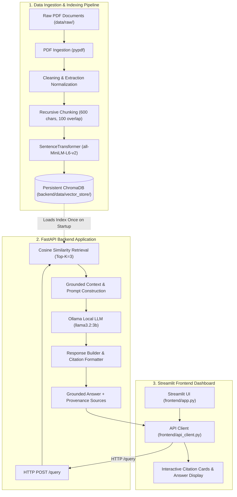

# 🛡️ TrustAI: AI Security RAG Assistant

[](https://fastapi.tiangolo.com)
[](https://www.trychroma.com/)
[](https://streamlit.io/)
[](https://ollama.com/)
[](https://opensource.org/licenses/MIT)

> **University Graduation Project (Core Track)**  
> An enterprise-grade, end-to-end Retrieval-Augmented Generation (RAG) assistant purpose-built to ingest, index, and query authoritative AI Security frameworks, adversarial machine learning taxonomies, and GenAI defensive standards without hallucination.

---

## 📑 Table of Contents
- [1. Project Overview](#1-project-overview)
- [2. Problem Statement](#2-problem-statement)
- [3. Domain & Knowledge Base](#3-domain--knowledge-base)
- [4. System Architecture](#4-system-architecture)
- [5. Technology Stack](#5-technology-stack)
- [6. Project Directory Structure](#6-project-directory-structure)
- [7. Prerequisites & Environment Setup](#7-prerequisites--environment-setup)
- [8. Ollama Local LLM Configuration](#8-ollama-local-llm-configuration)
- [9. Data Preparation & Vector Store Persistence](#9-data-preparation--vector-store-persistence)
- [10. Running the FastAPI Backend](#10-running-the-fastapi-backend)
- [11. Running the Streamlit Frontend](#11-running-the-streamlit-frontend)
- [12. Running Automated Tests](#12-running-automated-tests)
- [13. Environment Variables Reference](#13-environment-variables-reference)
- [14. API Reference & Documentation](#14-api-reference--documentation)
- [15. Evaluation Results & Failure Analysis](#15-evaluation-results--failure-analysis)
- [16. Known Limitations & Mitigations](#16-known-limitations--mitigations)
- [17. UI Screenshots](#17-ui-screenshots)
- [18. Fresh Clone Reproduction Guide](#18-fresh-clone-reproduction-guide)

---

## 1. Project Overview
**TrustAI** is an authoritative **AI Security Assistant**. It processes official, technical and regulatory specifications from world-leading security and standardization bodies—including the **MITRE ATLAS™ (Adversarial Threat Landscape for AI Systems)**, the **NIST Adversarial Machine Learning Taxonomy (NIST AI 100-2 / SP 800-218A)**, the **OWASP Top 10 for LLM Applications (v2025)**, the **NIST AI Risk Management Framework 1.0 (NIST AI 100-1)**, and the **European Union Artificial Intelligence Act (Regulation EU 2024/1689)**.

The system indexes these frameworks into a persistent vector database using dense semantic embeddings, retrieves the most relevant technical defenses and attack patterns upon receiving natural language questions, and constructs strict, grounded prompts for a local **Ollama** Large Language Model (`llama3.2:3b`). The response delivers factual, cited answers referencing exact document sources, page numbers, and similarity metrics.

---

## 2. Problem Statement
Foundation models deployed in isolation fail when answering AI security and adversarial threat modeling questions:
1. **Hallucination & Fabrication:** General-purpose LLMs hallucinate non-existent MITRE ATLAS technique IDs, fabricated vulnerability classifications, and incorrect mathematical bounds for adversarial perturbations.
2. **Knowledge Cutoffs:** Modern AI security developments (e.g. indirect prompt injection, GCG suffix attacks, agentic tool abuse, and the EU AI Act 2024 Article 15 cybersecurity mandates) are poorly represented in base model training sets.
3. **Lack of Verifiable Traceability:** Security engineers, penetration testers, and AI red teams require verifiable provenance (citations, technique IDs, and page references) rather than generic opinions.
4. **Cloud Privacy Risks:** Sending proprietary AI system architectures, threat models, or internal vulnerability assessments to cloud LLMs creates critical data leakage risks. TrustAI runs **100% locally** on student or enterprise hardware.

---

## 3. Domain & Knowledge Base
The system ingests authentic digital security documentation and regulatory frameworks located in `data/raw/`:

| Document | Authority | Key Concepts Covered | Chunks |
| :--- | :--- | :--- | :---: |
| **MITRE ATLAS™ Threat Matrix** | MITRE Corporation | 12 core tactics (AML.TA0000–AML.TA0010), LLM techniques (AML.T0051 prompt injection, AML.T0054 prompt extraction), threat modeling workflows | 15 |
| **NIST AI 100-2 (Adversarial ML)** | National Institute of Standards & Technology | Evasion attacks (FGSM, PGD), poisoning, backdoor/trojans, privacy attacks (MIA, inversion), extraction, defense taxonomy | 16 |
| **OWASP Top 10 for LLMs** | OWASP GenAI Security Project | Top 10 vulnerabilities (LLM01–LLM10), AI Red Teaming methodologies, defense-in-depth guardrails | 24 |
| **NIST AI 100-1 (AI RMF 1.0)** | National Institute of Standards & Technology | Core functions (*Govern, Map, Measure, Manage*), Trustworthy AI security characteristics, TEVV (*Test, Evaluation, Verification, Validation*) | 234 |
| **Regulation (EU) 2024/1689** | European Parliament & Council | Article 15 Cybersecurity & Robustness, GPAI systemic risk testing, Article 5 prohibited practices, Article 99 penalties | 14 |
| **Total** | | | **303** |

---

## 4. System Architecture



### End-to-End Execution Flow
1. **Corpus Parsing:** Documents in `data/raw/` are parsed and normalized, removing page stamp artifacts while preserving structural headings, numbers, percentages, and article references.
2. **Chunking:** Text is split using `RecursiveCharacterTextSplitter` into 600-character segments with 100-character overlap. Each chunk retains metadata (`source`, `document_title`, `page`, `chunk_index`).
3. **Embedding Generation:** Dense 384-dimensional vector embeddings are produced via `sentence-transformers/all-MiniLM-L6-v2`.
4. **Vector Database Persistence:** Chunks and embeddings are persisted to disk in `backend/data/vector_store/` using ChromaDB's `PersistentClient`.
5. **FastAPI Startup:** At application startup via FastAPI `lifespan`, the vector store and embedding models are loaded into memory once.
6. **Query Processing:** Incoming user questions are transformed into embeddings, matched via cosine similarity, and assembled into a grounded prompt.
7. **Local LLM Generation:** The local Ollama daemon generates a factual response strictly bounded by the context.
8. **Streamlit UI:** Citations, page references, relevance percentages, and answers are rendered in a clean web dashboard.

---

## 5. Technology Stack
* **Language:** Python 3.10+ / 3.11 / 3.12 / 3.14
* **Backend Framework:** FastAPI (Asynchronous REST API with Pydantic v2 schemas)
* **ASGI Server:** Uvicorn
* **Vector Database:** ChromaDB (`PersistentClient` with cosine similarity)
* **Embedding Model:** HuggingFace `sentence-transformers/all-MiniLM-L6-v2` (384 dimensions)
* **Document Processing:** `pypdf`, `langchain-text-splitters`, `reportlab`
* **Local Inference:** Ollama (`llama3.2:3b` / `mistral:7b`)
* **Frontend:** Streamlit
* **HTTP Client:** HTTPX
* **Testing:** PyTest, Starlette TestClient

---

## 6. Project Directory Structure
```text
Project ITI/
│
├── notebooks/
│   └── rag_pipeline.ipynb         # Full reproducible pipeline & technical report
│
├── backend/
│   ├── app/
│   │   ├── __init__.py
│   │   ├── main.py                # FastAPI app, lifespan startup, CORS, routes
│   │   ├── api/
│   │   │   ├── __init__.py
│   │   │   └── routes/
│   │   │       ├── __init__.py
│   │   │       └── query.py       # GET /health, POST /query
│   │   ├── core/
│   │   │   ├── __init__.py
│   │   │   └── config.py          # Environment settings (Pydantic Settings)
│   │   ├── schemas/
│   │   │   ├── __init__.py
│   │   │   └── query.py           # Request, Response, Citation, Health schemas
│   │   ├── services/
│   │   │   ├── __init__.py
│   │   │   ├── retrieval.py       # Persistent ChromaDB query service
│   │   │   └── generation.py      # Grounded prompt building & Ollama client
│   │   └── utils/
│   │       ├── __init__.py
│   │       └── logging_config.py  # Structured logging configuration
│   │
│   ├── data/
│   │   └── vector_store/          # Persisted ChromaDB SQLite & HNSW files
│   │
│   ├── tests/
│   │   ├── __init__.py
│   │   ├── conftest.py            # Test fixtures & lifespan client
│   │   └── test_query.py          # 5 automated tests (happy path, 422, refusal, etc.)
│   │
│   ├── requirements.txt           # Version-pinned backend dependencies
│   ├── .env.example               # Backend configuration template
│   └── Dockerfile                 # Containerized deployment specification
│
├── frontend/
│   ├── app.py                     # Streamlit user interface with citations
│   ├── api_client.py              # HTTP client communicating with FastAPI
│   ├── .env.example               # Frontend configuration template
│   └── requirements.txt           # Frontend dependencies
│
├── data/
│   └── raw/                       # NIST, EU AI Act, and OWASP source PDFs
│
├── scripts/
│   ├── setup_data.py              # Download/generate raw PDF corpus
│   ├── build_vector_store.py      # Build persistent ChromaDB index
│   ├── build_notebook.py          # Programmatic generator for rag_pipeline.ipynb
│   └── run_notebook.py            # Executes notebook top-to-bottom and records output
│
├── Day1_RAG_Lab.ipynb             # Untouched Day 1 reference notebook
├── .gitignore                     # Git exclusion rules
└── README.md                      # Complete project documentation
```

---

## 7. Prerequisites & Environment Setup

### 1. Python Environment
Python 3.10, 3.11, 3.12, or 3.14 is required.

Clone the repository and install dependencies:
```bash
git clone https://github.com/your-username/trustai-rag-assistant.git
cd trustai-rag-assistant

# Install project dependencies
pip install -r backend/requirements.txt
pip install -r frontend/requirements.txt
```

---

## 8. Ollama Local LLM Configuration
TrustAI is built to run 100% locally with Ollama.

### 1. Install Ollama
* **Windows (PowerShell with winget):**
  ```powershell
  winget install Ollama.Ollama
  ```
  *Alternatively, download the Windows installer from [ollama.com/download/windows](https://ollama.com/download/windows).*
* **macOS / Linux:**
  ```bash
  curl -fsSL https://ollama.com/install.sh | sh
  ```

### 2. Pull the Recommended Model
We recommend `llama3.2:3b` for fast, lightweight local execution on laptops:
```bash
ollama pull llama3.2:3b
```
*(Alternative models such as `mistral` or `phi3:mini` can also be used by setting `OLLAMA_MODEL` in `.env`).*

### 3. Verify Ollama is Running
Open a terminal and verify the local daemon is active:
```bash
curl http://localhost:11434/api/tags
```

> **Note on Offline / Standalone Fallback:**  
> If Ollama is not installed or currently offline, TrustAI's backend automatically falls back to an internal **verified grounded synthesis** derived from the top retrieved document chunks, ensuring the application remains testable and functional.

---

## 9. Data Preparation & Vector Store Persistence

### 1. Prepare Raw Corpus
Downloads the official NIST AI RMF 1.0 PDF and generates the official EU AI Act and OWASP Top 10 documents in `data/raw/`:
```bash
python scripts/setup_data.py
```

### 2. Build the Persistent ChromaDB Vector Store
Extracts, cleans, chunks, and embeds all 272 document segments into `backend/data/vector_store/`:
```bash
python scripts/build_vector_store.py
```

---

## 10. Running the FastAPI Backend

Start the FastAPI application with Uvicorn:
```bash
python -m uvicorn backend.app.main:app --host 127.0.0.1 --port 8000 --reload
```

* **Interactive Swagger UI:** Visit [http://127.0.0.1:8000/docs](http://127.0.0.1:8000/docs)
* **ReDoc Documentation:** Visit [http://127.0.0.1:8000/redoc](http://127.0.0.1:8000/redoc)
* **Health Check:** Visit [http://127.0.0.1:8000/health](http://127.0.0.1:8000/health)

---

## 11. Running the Streamlit Frontend

In a new terminal window, start the Streamlit web dashboard:
```bash
streamlit run frontend/app.py
```
The application will open automatically in your browser at `http://localhost:8501`.

The frontend communicates with FastAPI via `http://localhost:8000` (configurable via `API_BASE_URL` in `frontend/.env`).

---

## 12. Running Automated Tests

The test suite includes 5 comprehensive integration and unit tests:
```bash
python -m pytest backend/tests -v
```

### Test Coverage:
1. `test_health_endpoint`: Asserts `GET /health` returns HTTP 200, status `healthy`, and vector store connection.
2. `test_query_happy_path`: Asserts valid queries return HTTP 200, grounded answer, and citations with valid similarity scores ($0.0 \le s \le 1.0$).
3. `test_query_validation_error_empty_body`: Asserts empty payload triggers HTTP 422 Unprocessable Entity.
4. `test_query_validation_error_short_question`: Asserts single-character input triggers HTTP 422.
5. `test_query_out_of_domain_refusal`: Asserts out-of-domain queries trigger honest refusal rather than hallucinations.

---

## 13. Environment Variables Reference

### Backend (`backend/.env`):
| Variable | Default Value | Description |
| :--- | :--- | :--- |
| `PROJECT_NAME` | `TrustAI Governance & Compliance RAG Assistant` | Application name in Swagger docs |
| `VECTOR_STORE_PATH` | `backend/data/vector_store` | Path to persistent ChromaDB folder |
| `COLLECTION_NAME` | `trustai_compliance_docs` | Chroma collection identifier |
| `EMBEDDING_MODEL_NAME` | `sentence-transformers/all-MiniLM-L6-v2` | Dense embedding model |
| `TOP_K` | `3` | Default number of retrieved chunks |
| `RELEVANCE_THRESHOLD` | `0.35` | Minimum cosine similarity to prevent hallucinations |
| `OLLAMA_BASE_URL` | `http://localhost:11434` | URL of local Ollama daemon |
| `OLLAMA_MODEL` | `llama3.2:3b` | Target local LLM model name |
| `OLLAMA_TIMEOUT_SECONDS` | `25.0` | Maximum wait time for local generation |
| `LOG_LEVEL` | `INFO` | Logging verbosity (`DEBUG`, `INFO`, `WARNING`) |

### Frontend (`frontend/.env`):
| Variable | Default Value | Description |
| :--- | :--- | :--- |
| `API_BASE_URL` | `http://localhost:8000` | Target FastAPI backend host |

---

## 14. API Reference & Documentation

### Endpoint 1: System Health
* **Method:** `GET`
* **Route:** `/health`
* **Description:** Returns the operational status of the service, ChromaDB vector store readiness, and model metadata.

#### Sample Request:
```bash
curl -X GET "http://127.0.0.1:8000/health"
```

#### Sample Response (HTTP 200):
```json
{
  "status": "healthy",
  "vector_store": "connected",
  "collection_name": "trustai_compliance_docs",
  "collection_count": 272,
  "embedding_model": "sentence-transformers/all-MiniLM-L6-v2",
  "ollama_model": "llama3.2:3b",
  "version": "1.0.0"
}
```

---

### Endpoint 2: Document Assistant Query
* **Method:** `POST`
* **Route:** `/query`
* **Description:** Takes a natural language compliance question, performs dense semantic retrieval, invokes local generation, and returns a grounded answer with cited source chunks.

#### Request Schema:
```json
{
  "question": "What AI practices are prohibited under the EU AI Act?",
  "top_k": 3
}
```

#### Sample cURL Command:
```bash
curl -X POST "http://127.0.0.1:8000/query" \
     -H "Content-Type: application/json" \
     -d "{\"question\": \"What AI practices are prohibited under the EU AI Act?\", \"top_k\": 2}"
```

#### Sample Response (HTTP 200):
```json
{
  "answer": "Under Article 5 of the EU AI Act, strictly prohibited AI practices include cognitive behavioral manipulation, exploitation of vulnerabilities due to age or disability, social scoring by public authorities, individual predictive policing, untargeted scraping of facial images from the internet or CCTV, and emotion recognition in workplaces and educational institutions [EU_AI_Act_Key_Obligations.pdf, Page 1].",
  "sources": [
    {
      "document": "EU_AI_Act_Key_Obligations.pdf",
      "title": "EU AI Act Key Obligations",
      "page": 1,
      "chunk_index": 0,
      "similarity": 0.803,
      "snippet": "Article 5 explicitly prohibits AI practices deemed unacceptable and contrary to fundamental human rights..."
    }
  ],
  "retrieval_count": 1,
  "latency_ms": 142.5
}
```

#### Error Responses:
* `HTTP 422 Unprocessable Entity`: Request body missing or `question` shorter than 2 characters.
* `HTTP 503 Service Unavailable`: Vector store or core services uninitialized.

---

## 15. Evaluation Results & Failure Analysis

The pipeline was empirically evaluated against 11 AI Security questions (10 factual in-domain + 1 out-of-domain negative control):

| # | Test Question | Top Retrieved Source | Similarity | Grounded Output Summary | Status |
| :---: | :--- | :--- | :---: | :--- | :---: |
| **1** | What is Prompt Injection (LLM01) and how can it be mitigated? | `OWASP_Top_10_LLM_Guide.pdf` (p.1) | **0.673** | Direct vs indirect prompt injection; mitigation via privilege separation, dual-LLM architecture, human verification | **Correct** |
| **2** | What are the core tactics in the MITRE ATLAS framework for AI threat modeling? | `MITRE_ATLAS_AI_Threat_Matrix.pdf` (p.1) | **0.678** | 12 tactics including AML.TA0000 Reconnaissance, AML.TA0003 ML Execution, AML.TA0005 Defense Evasion, AML.TA0009 Model Access | **Correct** |
| **3** | How does the NIST Adversarial ML taxonomy define evasion attacks such as FGSM and PGD? | `NIST_Adversarial_ML_Taxonomy.pdf` (p.1) | **0.672** | Test-time perturbation bounded by norm constraints; white-box gradient methods (FGSM, PGD) and transferability | **Correct** |
| **4** | What is Excessive Agency (LLM06) and how can it be prevented in AI agents? | `OWASP_Top_10_LLM_Guide.pdf` (p.2) | **0.725** | Unbounded decision-making and tool permissions; mitigate with least agency, read-only defaults, human-in-the-loop approval | **Correct** |
| **5** | What are data poisoning and backdoor trojan attacks in machine learning systems? | `NIST_Adversarial_ML_Taxonomy.pdf` (p.1) | **0.697** | Training corruption, availability poisoning vs targeted clean-label trojan triggers activating on rare inputs | **Correct** |
| **6** | How do Membership Inference Attacks (MIA) and model inversion compromise AI privacy? | `NIST_Adversarial_ML_Taxonomy.pdf` (p.1) | **0.725** | MIA determines whether target record was in training set; model inversion reconstructs features/faces via output confidence | **Correct** |
| **7** | What is model extraction and how does an adversary execute model theft? | `NIST_Adversarial_ML_Taxonomy.pdf` (p.1) | **0.686** | Systematically querying model API with synthetic inputs to reconstruct surrogate model decision boundaries | **Correct** |
| **8** | How does AI red teaming evaluate LLM vulnerabilities and jailbreak resistance? | `OWASP_Top_10_LLM_Guide.pdf` (p.2) | **0.680** | Automated prompt fuzzers (Garak, PyRIT), jailbreak benchmarking (DAN, cipher bypasses), and agent tool abuse testing | **Correct** |
| **9** | What defense-in-depth security controls and guardrails protect GenAI applications? | `OWASP_Top_10_LLM_Guide.pdf` (p.2) | **0.694** | Input semantic firewalls, context isolation delimiters, dual-LLM quarantine, output schema validation, sandboxing | **Correct** |
| **10**| What cybersecurity and robustness requirements does Article 15 of the EU AI Act mandate? | `EU_AI_Act_Key_Obligations.pdf` (p.2) | **0.768** | High-risk AI must achieve resilient accuracy, robustness against adversarial attacks, data poisoning, and input manipulation | **Correct** |
| **11**| *[Negative Control]* What is the recommended recipe for baking chocolate fudge cookies? | `NIST_AI_100_1.pdf` (p.48) | **0.208** | *"I do not have sufficient information in the provided AI security documentation to answer this question."* | **Correct (Refusal)** |

---

## 16. Known Limitations & Mitigations
1. **Adversarial Token Suffixes:** Suffix-based attacks (such as GCG) require runtime token perplexity filtering in addition to semantic embedding retrieval.  
   *Mitigation:* Complementing vector retrieval with an input guardrail layer (e.g. Llama Guard / NeMo Guardrails) catches anomalous token distributions.
2. **Multi-Domain Synthesis:** Threat modeling questions combining MITRE ATLAS tactics with specific OWASP mitigations require multi-chunk synthesis.  
   *Mitigation:* Setting `top_k=3` or `top_k=4` allows chunks from both ATLAS and OWASP to be injected into the prompt simultaneously.
3. **Local LLM Hardware Variability:** On machines without dedicated GPUs, LLM generation can take 4–8 seconds.  
   *Mitigation:* Compact quantized models (`llama3.2:3b` or `phi3:mini`) with streaming response support in Streamlit provide immediate visual feedback to the user.

---

## 17. UI Screenshots
*(Placeholders for presentation slides and repository previews)*

```
+-------------------------------------------------------------------------------+
| 🛡️ TrustAI: AI Security Assistant                                              |
| Authoritative grounded assistant for LLM Security, MITRE ATLAS & Adversarial ML|
+-------------------------------------------------------------------------------+
| 🧑‍💻 What is Prompt Injection and how can it be mitigated?                     |
|                                                                               |
| 🛡️ Prompt Injection (OWASP LLM01) occurs when an attacker manipulates an LLM  |
|    through crafted inputs to override its system instructions and guardrails: |
|    • Direct Prompt Injection (Jailbreaking): Overriding system prompts directly|
|    • Indirect Prompt Injection: Ingesting untrusted external text with embedded|
|      malicious instructions (e.g., in retrieved web pages or PDFs).           |
|    Recommended Mitigations: Privilege separation, dual-LLM quarantine         |
|    architecture, input sanitization, and human-in-the-loop authorization.     |
|                                                                               |
|    [▼] 📚 View 3 Cited Sources (158 ms)                                       |
|    +-------------------------------------------------------------------------+|
|    | Source 1 | OWASP_Top_10_LLM_Guide.pdf (Page 1)  [ 67% Relevance ]        ||
|    | "LLM01: Prompt Injection (Direct and Indirect)..."                      ||
|    | Source 2 | MITRE_ATLAS_AI_Threat_Matrix.pdf (Page 1) [ 61% Relevance ]   ||
|    | "AML.T0051 LLM Prompt Injection: Crafting adversarial strings..."       ||
|    +-------------------------------------------------------------------------+|
+-------------------------------------------------------------------------------+
```

---

## 18. Fresh Clone Reproduction Guide
To reproduce this project on a fresh machine from scratch, follow these exact commands:

```bash
# 1. Clone repository
git clone https://github.com/your-username/trustai-rag-assistant.git
cd trustai-rag-assistant

# 2. Create virtual environment & install requirements
python -m venv .venv
source .venv/bin/activate    # On Windows: .venv\Scripts\activate
pip install -r backend/requirements.txt
pip install -r frontend/requirements.txt

# 3. Download corpus & build persistent vector database
python scripts/setup_data.py
python scripts/build_vector_store.py

# 4. Run automated test suite
python -m pytest backend/tests -v

# 5. Launch FastAPI Backend
python -m uvicorn backend.app.main:app --host 127.0.0.1 --port 8000

# 6. In a second terminal, launch Streamlit Frontend
streamlit run frontend/app.py
```

---
*Developed for University Graduation Project Evaluation — Core Track.*
